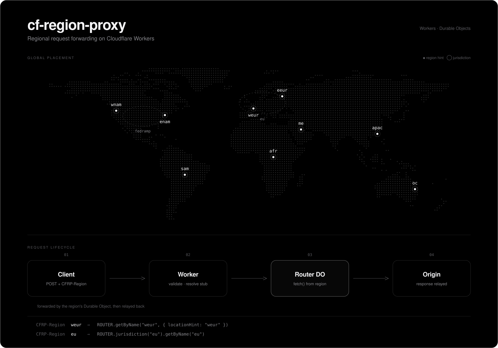

# cf-region-proxy

Programmatic regional request forwarding on Cloudflare Workers. Send a structured request, pick a Cloudflare region or jurisdiction, and have it forwarded from a Durable Object placed there.



## how it works

1. You `POST` a JSON envelope describing the request, with a `CFRP-Region` header naming a region hint or a jurisdiction.
2. The Worker validates the code and resolves a Durable Object stub:
   - region hints (`weur`, `apac`, ...) use `ROUTER.getByName(code, { locationHint: code })`
   - jurisdictions (`eu`, `fedramp`) use `ROUTER.jurisdiction(code).getByName(code)`
3. The Durable Object performs the upstream `fetch()`, so egress originates from that data center.
4. The response status, body, and headers are relayed back. Hop-by-hop headers, plus `content-encoding` and `content-length` (invalidated because the body is decoded), are stripped.

Durable Object names are deterministic, so the object is created on first access. No KV mapping is needed.

## regions

| `CFRP-Region` | kind | placement |
| --- | --- | --- |
| `wnam` | hint | Western North America |
| `enam` | hint | Eastern North America |
| `sam` | hint | South America (spawns nearby today) |
| `weur` | hint | Western Europe |
| `eeur` | hint | Eastern Europe |
| `apac` | hint | Asia-Pacific |
| `oc` | hint | Oceania |
| `afr` | hint | Africa (spawns nearby today) |
| `me` | hint | Middle East (spawns nearby today) |
| `eu` | jurisdiction | European Union |
| `fedramp` | jurisdiction | FedRAMP-Moderate data centers |

## request format

The body is a JSON envelope. `url` is required; everything else is optional and defaults to a `GET`.

```json
{
  "url": "https://example.com",
  "method": "GET",
  "headers": { "X-Example": "hello" },
  "body": "{\"ping\":\"pong\"}"
}
```

## curl

Forward a `GET` from Western Europe:

```bash
curl -X POST https://cfrp.prdai.dev \
  -H "CFRP-Region: weur" \
  -H "Content-Type: application/json" \
  -d '{"url":"https://example.com","method":"GET"}'
```

See which region actually handled it by reading the `colo=` line:

```bash
curl -X POST https://cfrp.prdai.dev \
  -H "CFRP-Region: weur" \
  -H "Content-Type: application/json" \
  -d '{"url":"https://www.cloudflare.com/cdn-cgi/trace","method":"GET"}'
```

`colo` is the IATA code of the data center that made the request, so it changes with `CFRP-Region` (`weur` -> `LHR`, `apac` -> `SIN`, `eu` -> `FRA`). `loc` is your own country and stays the same no matter which region you pick.

`POST` with headers and a body, from Eastern North America:

```bash
curl -X POST https://cfrp.prdai.dev \
  -H "CFRP-Region: enam" \
  -H "Content-Type: application/json" \
  -d '{"url":"https://httpbin.org/anything","method":"POST","headers":{"X-Example":"hello"},"body":"{\"ping\":\"pong\"}"}'
```

Run inside the EU jurisdiction:

```bash
curl -X POST https://cfrp.prdai.dev \
  -H "CFRP-Region: eu" \
  -H "Content-Type: application/json" \
  -d '{"url":"https://example.com"}'
```

An unknown code returns `400`:

```bash
curl -X POST https://cfrp.prdai.dev \
  -H "CFRP-Region: nope" \
  -H "Content-Type: application/json" \
  -d '{"url":"https://example.com"}'
```

## limits

- Bodies are text only; binary and streaming payloads are not handled.
- Location hints are best effort, not guarantees. `me`, `afr`, and `sam` do not spawn yet and land in a nearby region.
- The jurisdiction path cannot be exercised in local `wrangler dev` because workerd does not implement jurisdiction restrictions.

## development

```bash
bun install
bun run dev
```

`make lint` and `make format` run Biome. Deploy with `bunx wrangler deploy` (custom domain `cfrp.prdai.dev`).
